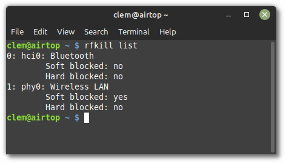

#########
Bluetooth
#########

Enabling/disabling Bluetooth
============================

Rfkill
------

Bluetooth can be disabled by using a software kill switch.

On some laptops, a hardware kill switch is also provided either via a special function key or key combination or a dedicated physical button or mechanism.

Using the `rfkill` command, you can see the state of these switches.

Open a terminal and type:

.. code-block:: bash

    rfkill list

The output lists the state of software and hardware kill switches for all your wireless devices:

In the picture above you can see that Bluetooth is neither `Soft blocked` nor `Hard blocked` and is therefore enabled.

You can use rfkill to block (i.e. disable) or unblock (i.e. enable) bluetooth:

.. code-block:: bash

    rfkill block bluetooth
    rfkill unblock bluetooth

Blueman
-------

Blueman is the default Bluetooth Manager in Linux Mint.

It provides the little Bluetooth icon in your system tray.

To disable Bluetooth right-click the tray icon and select `Turn Bluetooth Off`.

To enable Bluetooth right-click the tray icon and select `Turn Bluetooth On`.

The very first time you open Blueman it asks if Bluetooth should be enabled automatically.

To check whether this feature is enabled open a terminal and type:

.. code-block:: bash

    gsettings get org.blueman.plugins.powermanager auto-power-on

If `auto-power-on` is set to `true`, Blueman automatically unblocks Bluetooth at startup.
Note that this setting is user-specific.

If you want to disable Bluetooth at startup you need to set `auto-power-on` to `false`:

.. code-block:: bash

    gsettings set org.blueman.plugins.powermanager auto-power-on false

.. note::

    The `auto-power-on` option was recently removed in Blueman's master branch. It's still present in Blueman 2.3.5 but it's likely to disappear in newer versions.

Systemd-rfkill
--------------

Systemd provides a service which saves the state of your kill switches during shutdown and restores them on the next boot.

This service is a core part of systemd and is installed in Linux Mint by default.

.. note::

    Blueman runs after systemd-rfkill, so if Blueman's `auto-power-on` setting is enabled it overrides systemd-rfkill.

Bluez
-----

Bluez is the Bluetooth stack used by Blueman.

Bluez has a setting called `AutoEnable` in the file `/etc/bluetooth/main.conf`.

If you don't want Bluez to automatically enable Bluetooth during boot set this option to false.
