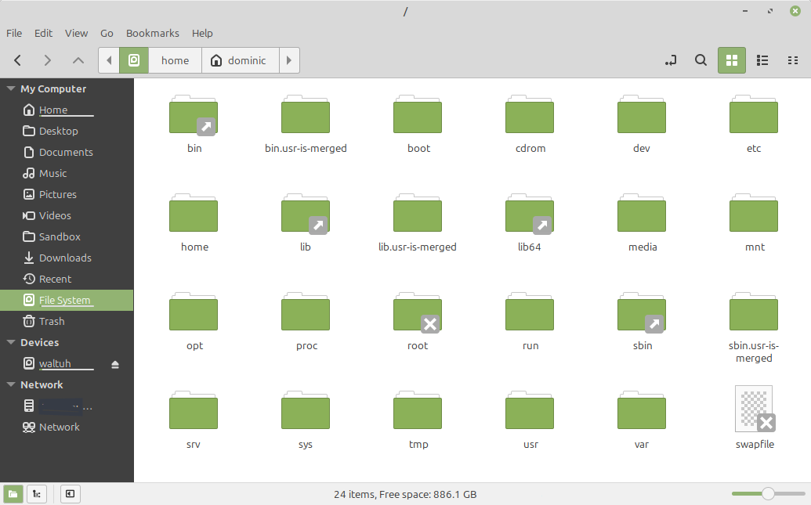

#######################
Nemo File Manager
#######################

Your New Home
==============

When you open the *Files* application, It opens up to the "Home" folder.

This is your personal space for your own files. No one except you and root admins can access them. However, any programs you put on the computer will be shared with *all* users

If you have a 

.. note::

   If you need to access another user's home folder for any reason as an admin, Go into the root folder, Which is explained below, open the "usr" folder, then open their folder, inputing your password when asked.

Root folder
============

At the root of the mint file system, is the humble "/". 

This folder is where all the files on your entire system drive are found. The closest equivalent to this the C:\ directory on Microsoft Windows.

However, The main difference with this is that non-admin users cannot access it, No matter what. They are locked to their Home directory

Generally speaking, if you want to change files across the entire system, 

