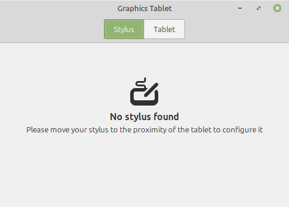
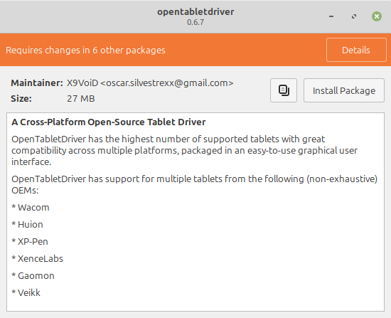

#########################
Graphics/Drawing Tablets
#########################

Wacom
=====

Generally speaking, If you have a Wacom graphics tablet should work out of the box by pulling up the *Graphics Tablet* program and holding or pressing your pen against the tablet. Just connect them via USB or :doc:`Bluetooth <bluetooth>`.

Everything else
===============

If you have a seperate brand of tablet, You may have to deal with drivers that act more akin to a trackpad rather than a drawing tablet. As a result, You may lose pressure sensitivity on your tablet. 

OpenTabletDriver (OTD)
----------------------

`OpenTabletDriver <https://opentabletdriver.net/>`_ is a driver for all major operating systems that gives open source compatibility to most Graphics Tablets.

Using this software enables pressure sensitivity and many other features not found on the Generic driver. Additionally, you get loads of additional customization for your tablet than before.

This software is not pre-installed on Linux Mint.

Installation
^^^^^^^^^^^^

.. note::

   Check if your tablet is compatiable with OTD before continuing `here <https://opentabletdriver.net/Tablets>`_.

Go to the website listed just above and press "Installation Guide" under the Linux box.

Download the .deb file and open it.

Make sure the kernals modules for Wacom and basic graphics tablet driver are unloaded with this terminal command

``sudo rmmod wacom hid_uclogic``

.. hint::

   Older (or custom) kernal versions may not have support for OTD, as they may have a setting named "CONFIG_INPUT_UINPUT" disabled. Refer to :doc:`Kernal Updates <mintupdate>` for information on how to update.
