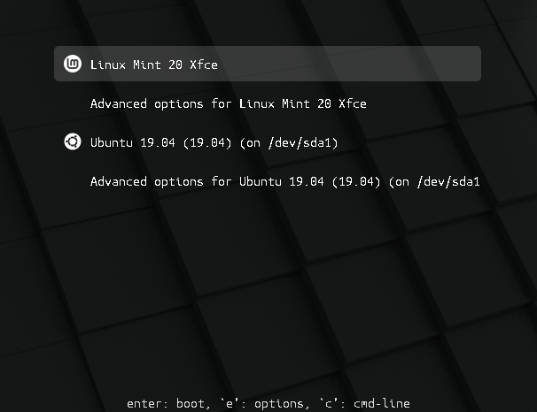

##############
Grub Boot Menu
##############

Grub is the boot menu.

If you have more than one operating system installed, it allows you to select which one to boot.

Grub is also useful for troubleshooting. You can use it to modify the boot arguments or to boot from an older kernel.

How to make the Grub menu always visible
========================================

If you only run Linux Mint and there are no other operating systems on the computer, starting with Linux Mint 21.3, the menu is shown for 3 seconds by default. In older releases it isn't shown. If you're using an older release from Linux Mint or upgraded to Linux Mint 21.3 instead of doing a fresh install, you can let it show up when you need it by pressing the shift key after the BIOS screen.

.. note::

    On some computers you might need to press the Escape key instead.

If you want to make it always visible, as root, add these lines to `/etc/default/grub.d/90_custom.cfg`:

.. code-block:: bash

    GRUB_TIMEOUT="3"
    GRUB_TIMEOUT_STYLE="menu"

Then type the following command in a terminal:

.. code-block:: bash

    sudo update-grub

If you are using Linux Mint 21.3 (or newer) and want to make the grub menu invisible, just delete these lines (which already exist) instead of adding them, then run the command above.

How to theme the Grub menu
==========================

For compatibility reasons, some releases sometimes ship without a Grub theme:

.. image:: images/grub.png

You can make it look like this:

To do so, open a terminal and type:

.. code-block:: bash

    apt install --reinstall -o Dpkg::Options::="--force-confmiss" grub2-theme-mint

Or if you have a HiDPI screen, type this instead:

.. code-block:: bash

    apt install --reinstall -o Dpkg::Options::="--force-confmiss" grub2-theme-mint-2k
