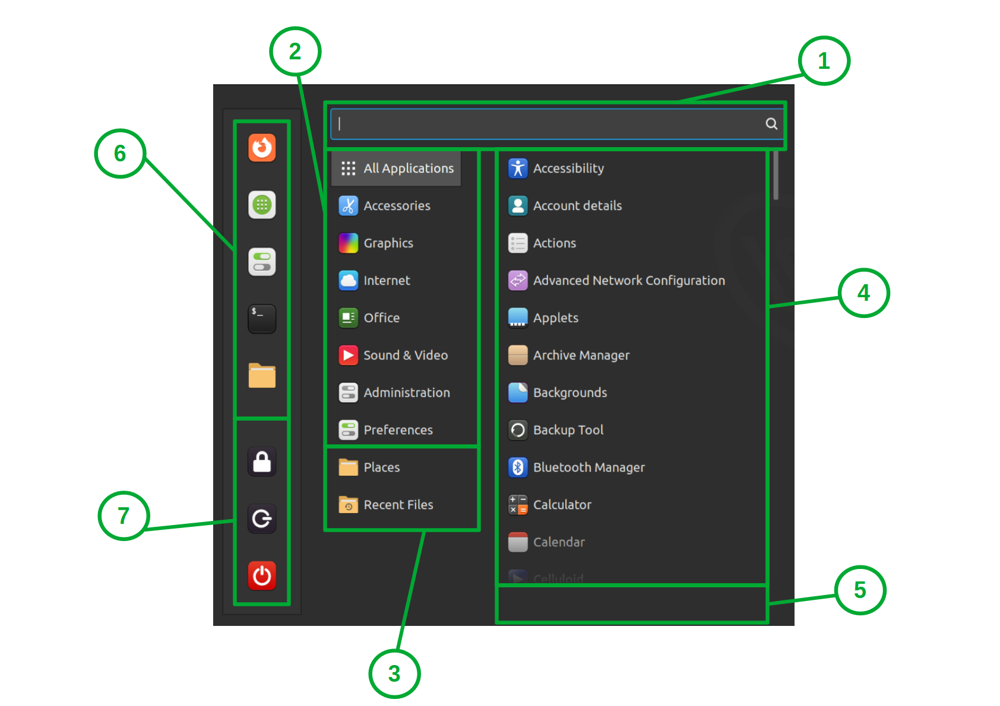
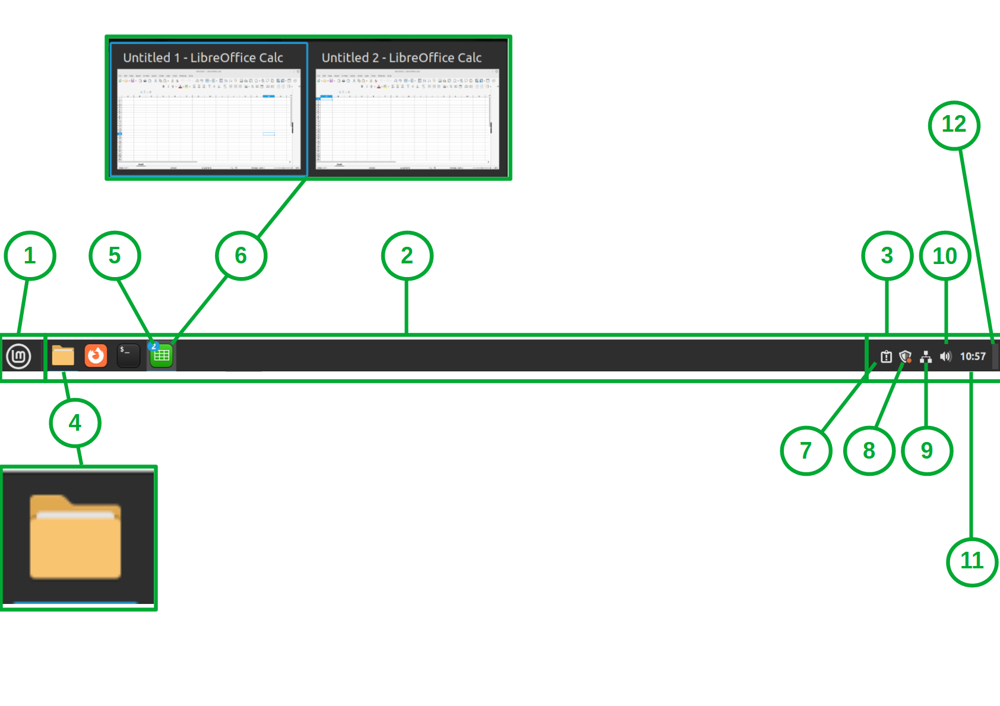
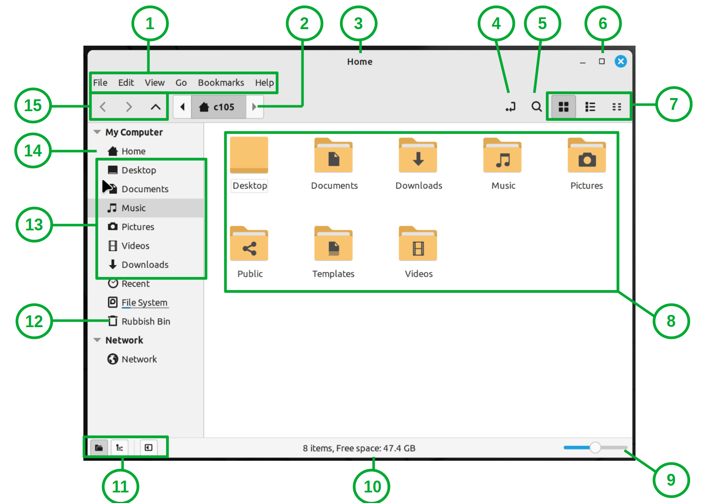
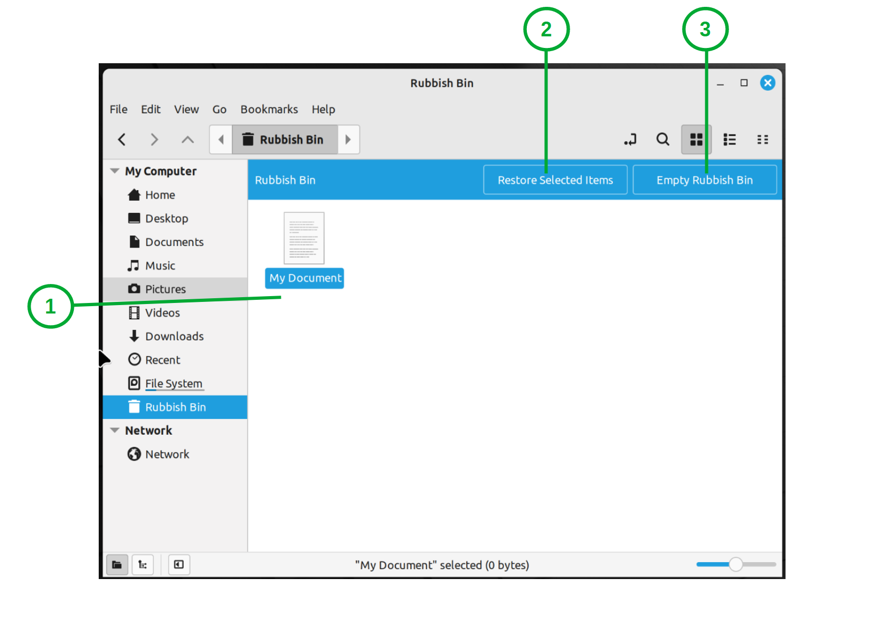

###############################################
Introduction to the Linux Mint Cinnamon Desktop
###############################################

If you selected to install Linux Mint Cinnamon, LMDE Cinnamon or Linux Mint Cinnamon Edge editions then no surprise you're running the Cinnamon Desktop.

Cinnamon is the name of the piece of software, which in this case, provides you with the interface and the tools you need to interact with your computer. This is sometimes called a "shell".

If you are used to the way the more classic versions of Windows looked and worked, then you'll likely get to grips with Cinnamon Desktop fairly quickly.

An Overview of Cinnamon Desktop
===============================

Here is what the standard Cinnamon Desktop looks like with a fresh install of Linux Mint:
.. image:: images/standard-cinnamon-desktop.png

Much like other systems you have three main areas:
1. Desktop
2. Programme Menu
3. Panel 

*Tip:* If you're not sure what something is, for example and icon, however your mouse cursor over it and wait a few seconds to see if a tooltip with more information shows up.

**Desktop**
This takes up the largest part of the screen and is where your desktop shortcuts, files, folders and background picture show. You can right-click on the empty space of the desktop to get additional options to perform tasks such as: create a new folder, change the background picture or configure your display settings. You will find that shortcuts to your removable media, such as CDs or USB drives, will show up on the desktop as icons to access them (people familiar with Mac OS should find this feature familiar).

**Programme Menu**

This menu is accessed by left-clicking on the Menu button in the left of the panel - this has the Linux Mint logo as it's icon. Alternatively, you can press the "Super" key on your keyboard (this is the key with the Windows logo on most keyboards). 

In here you can find the installed programmes/applications, administer the computer and access your files and folders. The shutdown, restart, lock and log off buttons can be found in here too. It is divided up in seven sections:

1. The search bar - here you can search for things on your computer.
2. Programme categories - programmes are grouped into subcategories based on their intended use. For example, the "Office" category contains productivity applications such as word processing and spreadsheet software. "Internet" contains applications for making use of the Internet such as web browsers, mail and chat clients. System settings can be found in the "Administration" and "Preferences" categories.
3. File and folder shortcuts - "Places" has links to commonly accessed folders, such as your "Documents", "Pictures" and "Downloads" folders. "Recent Files" has links to your most recently accessed files.
4. This is where the applications or files and folders will show when you select a category from sections 2 or 3. To select a section, hover your mouse over it for a moment and then move you mouse over to this section (4), to then open an item left-click on it.
5. Application information - if you're not sure what an item is in the Programme Menu, however your mouse over the icon. The name of the programme and a brief description will then show in this area.
6. Favourites - this is where favourited programmes will show. By default, you have the following programmes favourited: Firefox, Software Manager, System Settings, Terminal and Files (Nemo).
7. Power and session controls - from here you can perform tasks such as: lock your computer, sign out, shutdown, reboot or suspend (hibernate) your computer. The red power button allows you to shut down, reboot or suspend your computer. The grey power button will allow you to log off or switch user. The padlock button will lock your computer. You can also lock your computer by pressing Crl + Alt + L on your keyboard.

**Panel**

This is the buzzing hub of all your computing activity. It is the bar which, by default, runs across the bottom of the screen. From here you can access the Programme Menu, start new programs, access already running programmes, modify some system settings and not to forget telling the time.

There are three sections from left to right:

1. *The Programme Menu button* - you can use this to open and close the Programme Menu.
2. *The Panel* - here you can pin shortcuts to your most frequently used applications and view and access any currently running applications. By default, there are three programmes pinned: Nemo (Access Files and Folders), Firefox (Browse the Internet) and Terminal (Perform Advanced Tasks Command Line).
3. *Tray* - these are icons which allow you quickly access to basic system settings such as volume and WiFi as well as showing the time. 

More detail:
4. Applications which are running have an underline, in this case in blue. The colour may vary depending on your theme.
5. If you have multiple instances of the same programme running it will be grouped as one icon in the panel. You can spot these as there will be a little circle in the top left of the icon indicating how many instances are running. In this example there are two spreadsheets open.
6. You can preview running programmes by hovering your mouse over the icon in the panel. A preview of all the running instances of the program will appear above the icon in the panel. If you have multiple instances of the same application running, such as two spreadsheets, you can switch between them using this technique. Each instance will have its own preview window. By left-clicking on the preview window you wish to view, will take you to that intance of the programme; in this case which spreadsheet.

Tray icons and controls:
7. This icon indicates the System Reports programme has something to bring to your attention. You can left-click this icon to view further information.
8. This is the update manager icon. There are various icons to indicate if the computer is up-to-date, needs attention or has updates pending. In this case there is an orange dot on the shield which indicates that updates are pending. You can left-click on this icon to view the Update Manager to find out more information.
9. This is your network status icon. It will indicate if you're connected to a network, offline and which type of connection you are using e.g. WiFi or a cable. You can left-click on this icon to configure your network settings. For example, to connect to a new WiFi connection.
10. Audio controls. This icon will indicate roughly how loud your volume has been set or if the computer has been muted. Left-clicking on this icon will bring up a pop-up to change the volume. If sound is playing, you may see some information about a song or video you are currently playing, such as the name and artist. In this case some basic media controls to pause and play will show here too. *Tip* you can turn the volume up and down by hovering your mouse over this icon and then using the scroller to turn the volume up and down.
11. The time, you can click on this to view the computer calendar and to access the date and time settings.
12. Right at the very end a small rectangle which when clicked will minimise all programmes and show the desktop.

Accessing Your Files and Folders
================================

A file manager is a programme which allows you to access and organise your files and folders. Cinnamon uses a file manager called Nemo.

If your files are saved to the desktop folder, they will be displayed in the desktop ready for you to open or modify. Just like other systems you can double-click to open files and folders. Drag and drop to move them. Right-click on them to choose other options and the delete key will do exactly when it says.

You can find other folders, such as "Documents", "Downloads" or "Pictures", by click on the folder icon in the Panel or opening the Programme Menu, then selecting "Places" and then clicking the folder you want to access such as "Documents". As with the desktop file and folder controls, the same applies here.

1. The menu bar. You can use this to customise the file manager and perform actions on your files and folders.
2. The breadcrumb trail. This provides a visual representation of the folder path. You can use this to quickly navigate up and down the folder path.
3. This is the title bar. The text will dynamically update to match the name of the folder you are currently in.
4. Toggle location entry button. This button allows you to switch between the breadcrumb trail and the folder address bar. This is useful if you need to copy the folder path or navigate manually using the address bar.
5. Search bar toggle button. This toggles the search bar on and off. This will allow you to search by file/folder name or by the file contents.
6. Window controls. From left to right they allow you to minimise, maximise or close the file manager window.
7. View mode - this allows you to choose how to contents of the folders are displayed. From left to right you have icon view (the default), list and compact.
8. Folder contents - this where the files and folders contained within the selected directory (folder) are displayed. You can double click on any of these items to open them or right-click on them to perform additional actions.
9. Zoom control - this allows you to adjust the visual size of the folder contents. You might want to use this to increase the size when browsing photos or reduce the size when there are a lot of document files. *Tip* in the display settings there is a scale tool if you wish to enlarge everything on the screen to make it easier on your eyes.
10. Information bar - this provides some basic information about the folder you are viewing on the item(s) you have selected. Such as how many items there are in a folder or how much disk space a file is using.
11. These buttons allow you to adjust the left navigation bar. From left to right: folder view (default), treeview and hide/show the left navigation bar.
12. Rubbish bin button - click this to see items you have deleted.
13. Bookmarked folders - by default these contain shortcuts to folders such as you Documents or Pictures. Using the "Bookmarks" menu in the menu bar, you can add, remove and modify these.
14. This is the left navigation bar. It contains links to folders you're likely to access most often. Removable storage will show in here as well as a link to your recently used files and deleted files. Network and cloud storage can also be linked in here.
15. Folder navigation buttons - here you have a back and forwards button, followed by go to parent folder button. You can use these to quickly go back to folders you were in recently and back again; like you can with the web.

**Deleted Items**

You can find the items you deleted and sent to the "trash" by clicking on the folder icon in the Panel or in the Programme Menu, then clicking on "Rubbish Bin" in the left tool bar. 

1. Deleted items
2. Button to restore selected items. You can select files to restore and then clicking the "Restore Selected Items". 
3. Empty rubbish button. If you don't want any of the files in this folder, to free up space you can click "Empty Rubbish Bin" to completely delete them from the system. *NOTE:* This function does not guarantee that your files will be unrecoverable, in this case you should use suitable drive wiping software for this task.

Creating Shortcuts to Your applications
=======================================

You can create shortcuts to your programmes in the Panel, Desktop and Programme Menu Favourites.

1. Open the Programme Menu
2. Find the programme which you want to make a shortcut to
3. Right-click on the programme and then choose one of the following: "Add to Panel", "Add to Desktop" or "Add to Favourites".

To remove the shortcut, repeat steps 1 and 2, then right-click and choose one of the following:  "Remove from Panel", "Remove from Desktop" or "Remove from Favourites".