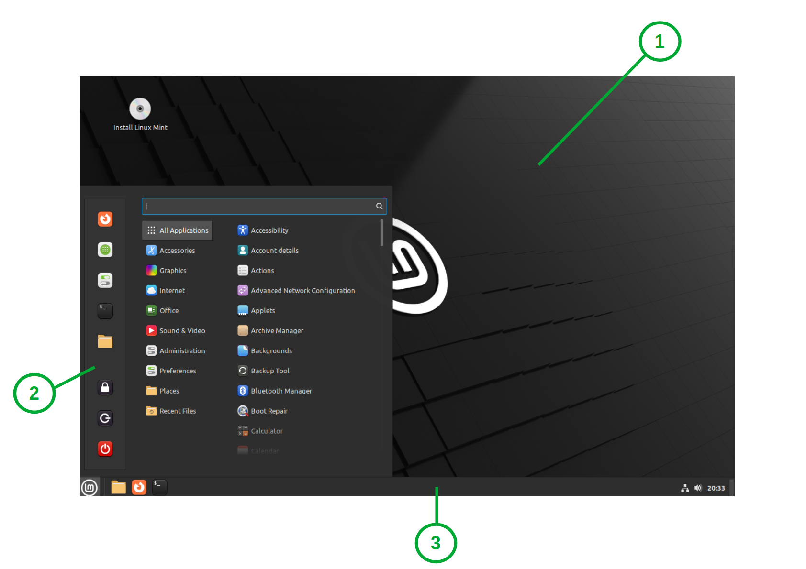

###############################################
Introduction to the Linux Mint Cinnamon Desktop
###############################################

If you selected to install Linux Mint Cinnamon, LMDE Cinnamon or Linux Mint Cinnamon Edge editions then no surprise you're running the Cinnamon Desktop.

Cinnamon is the name of the piece of software, which in this case, provides you with the interface and the tools you need to interact with your computer. This is sometimes called a "shell".

If you are used to the way the more classic versions of Windows looked and worked, then you'll likely get to grips with Cinnamon Desktop fairly quickly.

An Overview of Cinnamon Desktop
===============================

Here is what the standard Cinnamon Desktop looks like with a fresh install of Linux Mint:

Much like other operating systems you have three main areas:
1. Desktop
2. Programme Menu
3. Panel 

*Tip:* If you're not sure what something is, for example and icon, however your mouse cursor over it and wait a few seconds to see if a tooltip with more information shows up.

**Desktop**
This takes up the largest part of the screen and is where your desktop shortcuts, files, folders and background picture show. You can right-click on the empty space of the desktop to get additional options to perform tasks such as: create a new folder, change the background picture or configure your display settings.

**Programme Menu**
This menu is accessed by left-clicking on the "Menu" button in the left of the panel. Alternatively you can press the "Super" key on your keyboard (this is the key with the Windows icon on most keyboards). 

In here you can find the installed programmes/applications, administer the computer and access your files and folders. The shutdown, restart, lock and log off buttons can be found in here too.

Programmes are grouped into sub categories based on their intended use. For example the "Office" category contains productivity applications such as word processing and spreadsheet software. "Internet" contains applications for making use of the Internet such as web browsers, mail and chat clients.

System settings can be found in the "Administration" and "Preferences" categories.

There is a search function too if you want to quickly find something.

Favourited programmes are show in the left of the menu as icons.

**Panel**
This is the buzzing hub of all your computing activity. It is the bar which, by default, runs across the bottom of the screen. From here you can access the Programme Menu, start new programs, access already running programmes, modify some system settings and not to forget tell the time.

There are three sections from left to right:

1. *The Programme Menu button* - you can use this to open and close the Programme Menu.
2. *The Panel* - here you can pin shortcuts to your most frequently used applications and view and access any currently running applications. By default there are three programmes pinned: Nemo (Access Files and Folders), Firefox (Browse the Internet) and Terminal (Perform Advanced Tasks Command Line).
3. *Tray* - these are a collections and text which allow you quick access to basic system settings such as volume and WiFi as well as showing the time and right at the very end a small rectangle which when clicked will minimise all programmes and show the desktop. If you click on these icons you will be given a popup to perform more actions. In the case of the time you will be presented with a calendar.

Accessing Your Files and Folders
================================

A file manager is a programme which allows you to access and organise your files and folders. Cinnamon uses a file manager called Nemo.

If your files are saved to the desktop folder, they will be displayed in the desktop ready for you to open or modify. Just like other systems you can double-click to open files and folders. Drag and drop to move them. Right-click on them to choose other options and the delete key will do exactly when it says (you will be prompted to confirm you choice first).

You can find other folders, such as "Documents", "Downloads" or "Pictures", by click on the folder icon in the Panel or opening the Programme Menu, then selecting "Places" and then clicking the folder you want to access such as "Documents". As with the desktop file and folder controls, the same applies here.

You can find the items you deleted and sent to the "trash" by clicking on the folder icon in the Panel or in the Programme Menu, then clicking on "Trash" in the left tool bar. From here you can select files to restore and then clicking the "Restore Selected Items". If you don't want any of the files in this folder, to free up space you can click "Empty Trash" to more permanently delete them from the system. *NOTE:* This function does not guarantee that your files will be unrecoverable, in this case you should use suitable drive wiping software for this task.

Creating Shortcuts to Your applications
=======================================

You can create shortcuts to your programmes in the Panel, Desktop and Programme Menu Favourites.

1. Open the Programme Menu
2. Find the programme which you want to make a shortcut to
3. Right-click on the programme and then choose one of the following: "Add to Panel", "Add to Desktop" or "Add to Favourites".

To remove the shortcut, repeat steps 1 and 2, then right-click and choose one of the following:  "Remove from Panel", "Remove from Desktop" or "Remove from Favourites".