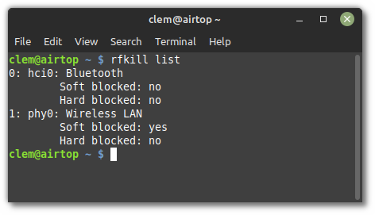

############
Networking
############

Permissions
============

By default, only admin users can disable or enable most networking settings.

Changing this is simple, they must be added to the ``netdev`` group.
This can be done with ``sudo adduser <username> netdev``.

``netdev`` is a grouping for non-admin users who are permitted to change settings for NetworkManager and Blueman.

Wi-Fi and Ethernet
==================

NetworkManager
---------------

The name is pretty self-explanatory, It's the default manager for the Wi-Fi, Ethernet, Mobile Broadband, and VPNs.

It provides an icon of two arrows going in separate directions in your system tray.

Enabling and Disabling Wireless is as easy as left-clicking the tray icon and clicking the box adjacent to `Wireless`.

Warpinator
-----------

`Warpinator <https://github.com/linuxmint/warpinator>` is a built in program that allows you to send files to other Windows and Linux computers, and Android devices across your local network.

When you first start up Warpinator, It will ask you to set up a unique group code. This allows you to enable Secure Mode. This mode disables startup during login, all transfers of files need to be approved by the sender and receiver, and the program closes after one hour. Turning on secure mode is advised as anyone who is able to connect to your local network will be able to send you potentially malicious files without secure mode enabled, as was proven with Leap.A worm for Mac.

.. note::

    A local network is all of the devices linked to your router. 
    Sometimes, if there are different bands that a Wi-Fi router puts out, like 2.4 and 5 ghz, devices that are on one band might not show up on the other.
    Simply connecting your computer to the same band often alivates this problem.

Bluetooth
==========

Blueman
-------

Blueman is the default Bluetooth Manager in Linux Mint.

It provides the little Bluetooth icon in your system tray.

To disable Bluetooth right-click the tray icon and select `Turn Bluetooth Off`.

To enable Bluetooth right-click the tray icon and select `Turn Bluetooth On`.

The very first time you open Blueman it asks if Bluetooth should be enabled automatically.

To check whether this feature is enabled open a terminal and type:

.. code-block:: bash

    gsettings get org.blueman.plugins.powermanager auto-power-on

If `auto-power-on` is set to `true`, Blueman automatically unblocks Bluetooth at startup.
Note that this setting is user-specific.

If you want to disable Bluetooth at startup you need to set `auto-power-on` to `false`:

.. code-block:: bash

    gsettings set org.blueman.plugins.powermanager auto-power-on false

.. note::

    The `auto-power-on` option was recently removed in Blueman's master branch. It's still present in Blueman 2.3.5 but it's likely to disappear in newer versions.

Bluez
-----

Bluez is the Bluetooth stack used by Blueman.

Bluez has a setting called `AutoEnable` in the file `/etc/bluetooth/main.conf`.

If you don't want Bluez to automatically enable Bluetooth during boot set this option to false.

Rfkill
======

Wi-Fi and Bluetooth can be disabled by using a software kill switch.

On some laptops, a hardware kill switch is also provided either via a special function key or key combination or a dedicated physical button or mechanism.

Using the `rfkill` command, you can see the state of these switches.

Open a terminal and type:

.. code-block:: bash

    rfkill list

The output lists the state of software and hardware kill switches for all your wireless devices:

In the picture above you can see that your networking is neither `Soft blocked` nor `Hard blocked` and is therefore enabled.

You can use rfkill to block (i.e. disable) or unblock (i.e. enable) bluetooth:

.. code-block:: bash

    rfkill block bluetooth
    rfkill unblock bluetooth

Systemd-rfkill
--------------

Systemd provides a service which saves the state of your kill switches during shutdown and restores them on the next boot.

This service is a core part of systemd and is installed in Linux Mint by default.

.. note::

    Blueman runs after systemd-rfkill, so if Blueman's `auto-power-on` setting is enabled it overrides systemd-rfkill.
