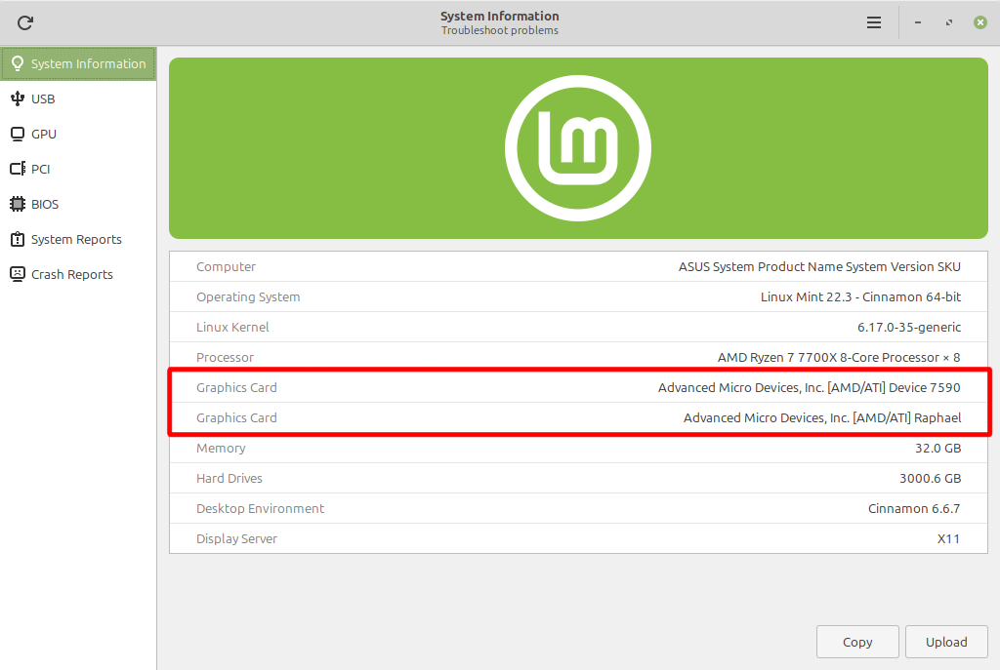
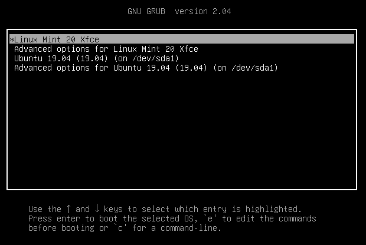
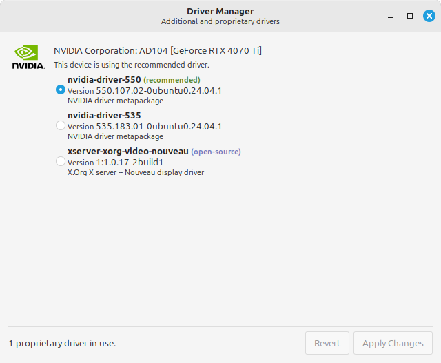
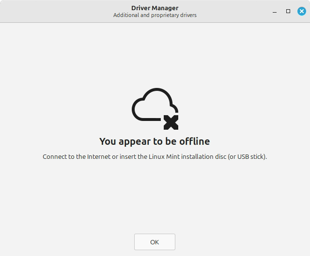

######################
Graphics Cards
######################

How to tell if my graphics cards have drivers already installed?
================================================================

Open up the *System Reports* program and navigate to System Information, Your graphics card and its driver should be listed. 

Alternatively, you can put ``LANG=C inxi -Gxxxc0`` into the *Terminal* program. There should be something in the ``driver:`` and something in the place of ``llvmpipe`` in ``renderer:``

If this is not the case for both, follow what is below.

AMD and Intel Cards
===================

All AMD drivers are bundled with Linux. You don't need to do anything unless it is a super recent piece of hardware, which you might need to :doc:`update your kernal for support <kernal-updates>` or install the :doc:`HWE version of Linux Mint <hwe>`.

For AMD cards, you may have to `upgrade the "amdgpu linux-firmware" <https://forums.linuxmint.com/viewtopic.php?t=424779#firmware>`_ 

NVIDIA Cards
============

These are not bundled with Linux and have to be installed separately. These instead will default to open-source drivers that may not work properly with your GPU.

.. note::
    
    It is advised that you do not install NVIDIA drivers off of their website, as you will need to reinstall said drivers each time there is a kernal update.

How to install NVIDIA drivers
-----------------------------

How to access desktop 
^^^^^^^^^^^^^^^^^^^^^

Restart, get to 'GNU GRUB 2.xx' screen by hitting Esc or holding shift. 

.. hint::

    UEFI systems press ``esc`` multiple times rapidly when the pc powers on

    Legacy-BIOS systems press and hold ``shift`` for 8 seconds at least after powering on

This must done BEFORE you see a Mint logo or other OS logo on screen (ie - before handover to the operating system startup)

After this is done right, you should see a menu as pictured above.

**Once you see the GRUB menu:**

Press ``e`` to edit startup parameters.

This will let you boot in safe graphics mode.

Add ``nomodeset`` after the words "quiet splash" on the second last line of the set parameters black screen preceded by a single space.

Press F10 to boot up

This should now allow you to boot fully to a visible, usable desktop. From there, you can access the *Driver Manager*.

Using Driver Manager
^^^^^^^^^^^^^^^^^^^^^

Open up the *Driver Manager* program, and wait to see what drivers you will have to install.

Generally, you should install the recommended version of a driver.

If you do not have internet, plug the USB (or DVD) you used to install Mint on into your computer and mount it inside of Driver Manager.

After you install the driver, **Do not** reboot yet, Open up terminal and run the following,

.. code-block:: bash

    sudo mokutil -i /var/lib/shim-signed/mok/MOK.der
    mokutil --list-enrolled
    sudo mokutil --test-key /var/lib/shim-signed/mok/MOK.der
    sudo mokutil --enable-validation

.. warning:: 

    At some point, It will ask you to create a password of minimum 8 characters. 
    **WRITE IT DOWN.**
    When you reboot, you will likely have to choose ``enable MOK`` from a blue screen and have to input the password you put down, you can then reboot from the blue screen

Troubleshooting
===============

Have you

1. Checked your display ports and cables?
2. Done what's above troubleshooting first?
3. Checked if either DisplayPort or HDMI connections work?

If all else fails, `This guide <https://forums.linuxmint.com/viewtopic.php?t=424779>`_ from the Linux Mint Forums should help.

And if that doesn't work, Don't be afraid to ask! We are always willing to help!

