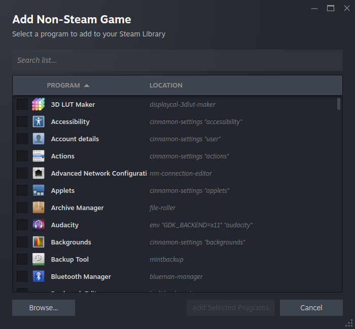

################
Gaming on Mint
################

Fun fact, Most Microsoft Windows games run near perfectly on Linux Mint. 

This is because of a program known as the `Wine Compatibility Layer<https://www.winehq.org/>`_ and its gaming cousin, Valve Corporation's Proton compatibility layer. 

Additionally, More games are having native Linux ports.

Steam Games
============

.. note::
   
   Some games may have something known as a "Kernal-Based Anti-Cheat". This prevents a game from working on Mint due to the Linux Kernal not allowing external software to insert itself, Primarially to prevent malware. Check compatibility.

For games and software purchased on Steam, Proton is used by default when a native Linux version is unavailable (you may need to enter steam's settings and "enable compatibility tools for all steam games").

If a game is on a Windows formatted drive, It may not run with proton properly. You can fix this by using the move feature in the "Storage" section in steam settings.

You should move your games to the Linux formatted drive.

If you want faster boot times for games, You should enable "Allow background processing of Vulkan shaders" under the "Downloads" section in Steam Settings. This however does require a more powerful computer.

Non-Steam Games
================

Adding via Steam
-----------------

You can add Non-Steam games to steam, enabling Proton compatibility by clicking on the "Add a Game" button in the Bottom-left corner of the steam page, clicking on "Add Non-Steam Game"

Roblox
-------

For Roblox, You can use *Sober* on the Software Manager. 

Minecraft
----------

For Minecraft, There is the *Prism Launcher* on the Software Manager. This allows you to download and create instances of Minecraft, It also has a native mod installer and launcher.

Other software
---------------

"PortProton" is a flatpak that gives you additional options for launchers outside of Steam. It also gives an easy to use interface for downloading versions of wine and proton.

"ProtonUp-Qt" allows you to download and apply community maintained versions of Proton to Steam, Which has greater capabilities as it is less constrained as Valve.

While primarily focused on gaming, "Lutris" is an excellent interface for running windows applications of any kind. It is available as a .deb or as a flatpak. 
