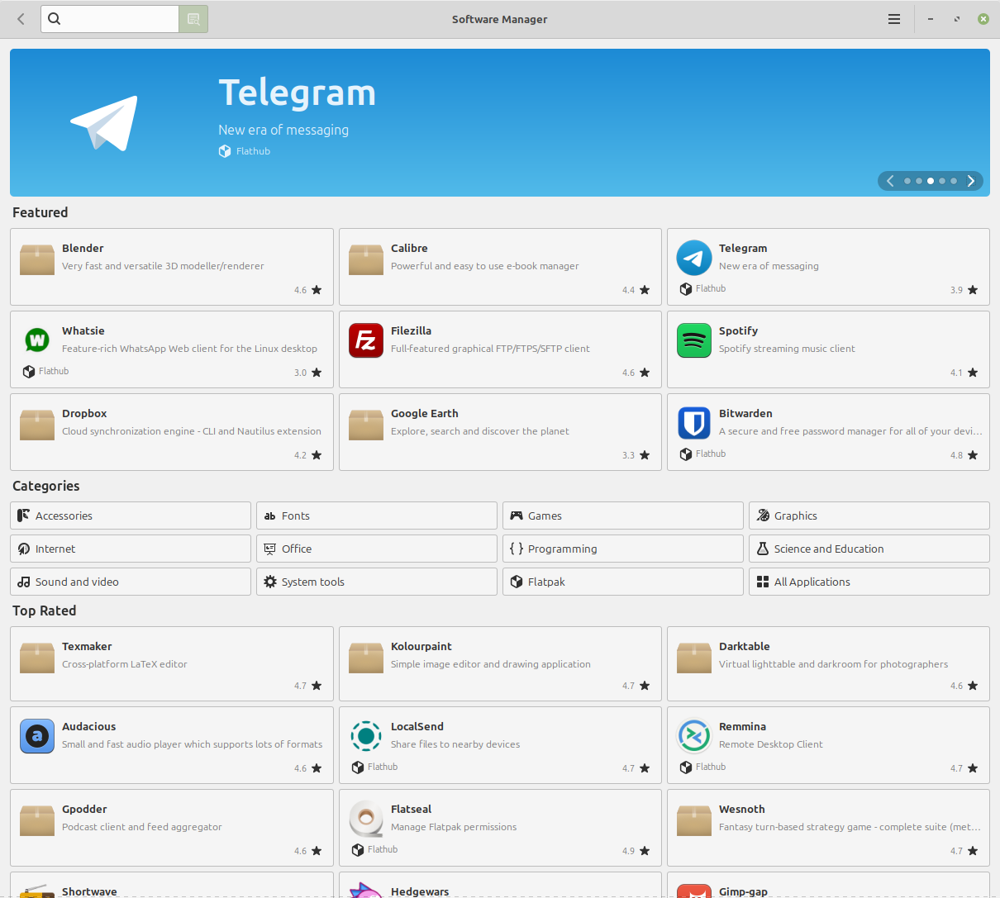
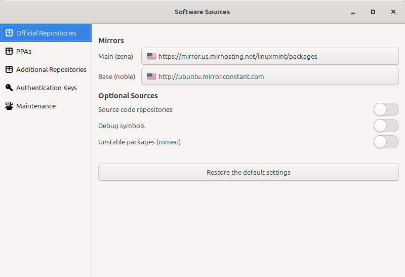

#################
Software Manager
#################

The software manager is the primary (and recomended) way someone can install software for Linux Mint.

Most software you would want on your computer can be found here. From Steam to Blender.

How to use it
=============

The interface should appear similar to app stores that are found on other operating systems. You can search for programs on the top bar. 

For instance, Lets look for `Gimp <https://gimp.org>`_, You search up gimp on the seach bar and you click on the first result that shows. There are two options below the install button, a system package version, or a flatpak version.

What's the difference between a system package and a flatpak?
--------------------------------------------------------------

System Packages
^^^^^^^^^^^^^^^

The more trustworthy option, as these versions have been made and verified to work perfectly by either the Ubuntu or Linux Mint team. However, They may not get as frequent of updates as the Flatpak version.

Flatpak Packages
^^^^^^^^^^^^^^^^^

Generally includes the latest version of a software, however are untested by Ubuntu or Mint developers and may not work as intended on Mint systems. They are additionally larger due to extra data having to be installed around them in order for it to work.

How it works
============

It works by pulling from the software sources that you set while setting up your update manager. They act akin to portals for System Packages and Updates, carrying all the data that you can pull from for updates and new software.

Flatpaks pull from a website called `Flathub <https://flathub.org/>`_, A centralized repository of flatpaks. Updates for Flatpaks are managed through the Update Manager.

Using seperate sources than the ones preset by the computer can massively speed up download speeds.

If you want to change these software sources:

1. Click on the three lines next to the minimize button.
2. Press on Software Sources 
3. Change both mirrors, Main and Base, by clicking on them and waiting for the network speed to come back (Be Patient, as this takes time.)
4. When that is done, click on "Click here to update the APT cache"

.. warning::

    If updating the APT cache fails, do **NOT** download or install new software or updates. Go back into software sources and check your mirrors, they cannot be "unreachable" or 0 kB/s. Once you have checked that, Try updating it again.

Alternatives
============

There are additional ways a person can install software on their computers. 

APT Terminal
-------------

A relatively simple way of installing programs. It is as easy to install as 2 terminal commands.

.. code-block:: bash

    sudo apt update
    sudo apt install [insert program name here]

.. note::

    Installing the snap store (snapd) through APT is disabled by default due to security concerns. If you wish to installing it regardless, refer to the bottom of this section.

Online .deb files
------------------

When you go to a website, you sometimes have the choice to install their software through a .deb (debian) package. These work akin to .exe files on Windows, It will install the program onto your computer without much fuss with only a double-click of your mouse.

Snap Store
-----------

.. _snapstore:

The `Snap Store <https://snapcraft.io/>`_, also known as the `Ubuntu Store`, is a commercial centralized software store operated by `Canonical <https://canonical.com/>`_.

Similar to AppImage or Flatpak the Snap Store is able to provide up to date software no matter what version of Linux you are running and how old your libraries are. 

Unfortunately, Following the decision made by Canonical to replace parts of APT with Snap and have the Ubuntu Store install itself without users knowledge or consent, the Snap Store is forbidden to be installed by APT in Linux Mint 20 and beyond.

.. note::

	For more information read the announcements made in `May 2020 <https://blog.linuxmint.com/?p=3906>`_ and `June 2019 <https://blog.linuxmint.com/?p=3766>`_.

Listed below is our reasoning.

Centralized control
^^^^^^^^^^^^^^^^^^^

Anyone can create APT repositories and distribute software freely. Users can point to multiple repositories and define priorities. Thanks to the way APT works, if a bug isn't fixed upstream, Debian can fix it with a patch. If Debian doesn't, Ubuntu can. If Ubuntu doesn't Linux Mint can. If Linux Mint doesn't, anyone can, and not only can they fix it, they can distribute it with a PPA.

Flatpak isn't as flexible. Still, anyone can distribute their own Flatpaks. If Flathub decides they don't want to do this or that, anyone else can create another Flatpak repository. Flatpak itself can point to multiple sources and doesn't depend on Flathub.

Although it is open-source, Snap on the other hand, only works with the Ubuntu Store. Nobody knows how to make a Snap Store and nobody can. The Snap client is designed to work with only one source, following a protocol which isn't open, and using only one authentication system. Snapd is nothing on its own, it can only work with the Ubuntu Store.

This is a store we can't audit, which contains software nobody can patch. If we can't fix or modify software, open-source or not, it provides the same limitations as proprietary software.

Backdoor via APT
^^^^^^^^^^^^^^^^

When Snap was introduced Canonical promised it would never replace APT. This promise was broken. Some APT packages in the Ubuntu repositories not only install snap as a dependency but also run snap commands as root without your knowledge or consent and connect your computer to the remote proprietary store operated by Canonical.

How to install the Snap Store in Linux Mint 20+
^^^^^^^^^^^^^^^^^^^^^^^^^^^^^^^^^^^^^^^^^^^^^^^^

Recommended or not, if you want to use the Snap Store, re-enabling and installing it is very easy.

.. code-block:: bash

	sudo rm /etc/apt/preferences.d/nosnap.pref
	apt update
	apt install snapd

