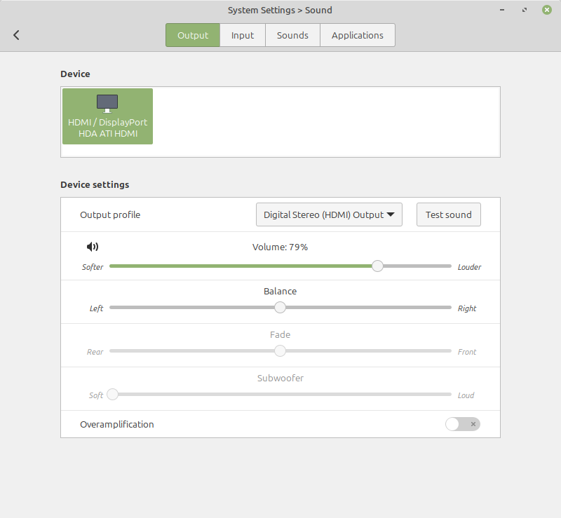
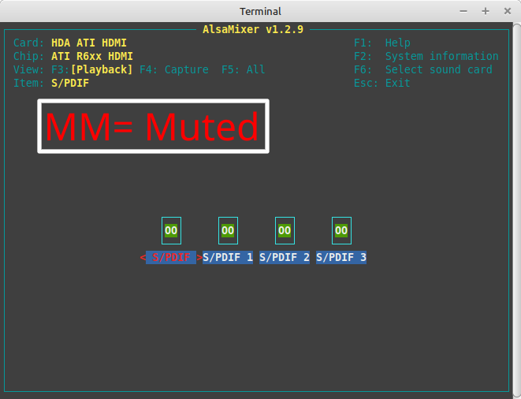

#################
Audio & Visual
#################

.. note::
   **Before anything else, Have you installed the multimedia codecs?** 

   In most cases, this will solve most of the issues a person may have.

   If it is not installed, see `Codecs in the Installation Guide <https://linuxmint-installation-guide.readthedocs.io/en/latest/codecs.html>`_.

Audio
======

Linux Mint 22+ uses an audio server known as "Pipewire". Versions 21 and below use "PulseAudio".

Basic Fixes
------------

Firstly, Check the audio settings inside of your system settings, making sure that the software is not muted and that it is outputting to the right device, Usually marked with "HDMI / DisplayPort" for Desktops.

Secondly, if that doesn't work, input into the *terminal* program :command:`alsamixer` and hit *f6*, select your sound card, and check if any of your outputs are marked as "MM", change those to "00"s and exit.

Sometimes, You will have to restart Pipewire (or PulseAudio) if this does not work. Open up the *terminal* program and run :command:`inxi -A` to find out what audio server your machine is using. 

Nextly, run 

.. code-block:: bash

   systemctl --user restart pipewire wireplumber pipewire-pulse 

for versions 22+ and running pipewire. 

**For versions 21 and under,** you use the command:

.. code-block:: bash

   systemctl --user restart pulseaudio

Changing from Pipewire to PulseAudio
-------------------------------------

If your issue isn't resolved with what is provided and you are using version 22+, You may have to downgrade your audio server back down to PulseAudio. You can do it with the following commands.

.. code-block:: bash

   apt purge pipewire pipewire-bin
   systemctl enable --user pulseaudio
   sudo reboot

Video
======

Often, Issues with these arise from the fact that people don't update their systems to the :doc:`correct kernel for their system<../mintupdate>`, that they lack the multimedia codecs, or that they don't have the proper drivers installed. 

Hardware Acceleration
----------------------

The video on browsers can be slowed down due to hardware acceleration being enabled automatically, leading to a slower and more strained CPU.

To disable this, go into Firefox settings through the 3 bar menu in the upper-right corner of the browser and select **Settings > Tabs & Browsing > Performance** and disable "Use recommended performance settings".

Nvidia Graphics Drivers
------------------------

Nvidia drivers do not come preinstalled and can lead to issues with video due to the backup drivers not working the greatest.

For assistance with that, refer to `this page regarding booting without the GPU <https://linuxmint-installation-guide.readthedocs.io/en/latest/boot_options.html#nomodeset-boot-option>`_.

Other Means
============

If all that could be done earlier has failed, Try the following-

1. Restart Your Computer
2. Set your computer's power mode to "Balanced" or "Performance" in System Settings > Power Management.
3. Bring your issue to the `Linux Mint Forums <https://forums.linuxmint.com/>`_ or `Discord <https://discord.gg/mint>`_ being ready to give audio specs with "`inxi -A`".
