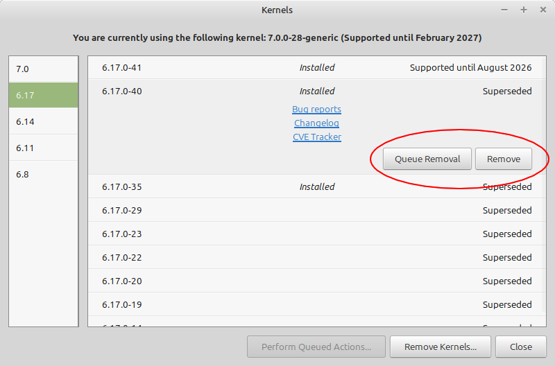

#####################
Kernel Panics
#####################

Kernel Panics occur when your machine doesn't know how to fix an error that is vital for the function of your computer, So it freezes itself to save vital data on the computer.

They are the practically the same as the Blue Screen of Death is on Microsoft Windows.

These can and are annoying, but are generally easy to remedy.

"I updated the kernel and it does that now"
====================================================

This is usually caused by a faulty kernel.

Reboot your system and rapidly click *etc* to enter the GRUB menu.

Next, use the arrow keys to select "Advanced options for Linux Mint". You should find the last kernel you used before, Select it.

Once you are on the desktop, go into the *Update Manager* program and select *View > Linux Kernels*.

Deactivate and delete the latest installed kernel.

"I have VirtualBox installed"
==============================

***It doesn't like updates to the kernel.***

You have to uninstall VirtualBox for any updates to the kernel to install properly, especially if it's a new version, like 7.0.0.

Reboot your system and rapidly click *etc* to enter the GRUB menu.

Next, use the arrow keys to select "Advanced options for Linux Mint". You should find the last kernel you used before, Select it.

Run "`sudo apt purge virtualbox`", including any additional VirtualBox add-ons that you got through the software manager.

Next, run "`sudo apt autoremove`" to purge any dependencies that are left around after getting rid of VirtualBox.

Lastly, run "`sudo apt install -f`" to fix the broken kernel.

.. note::

   You can find the latest (non-vetted) version of VirtualBox `here <https://www.virtualbox.org/wiki/Linux_Downloads>`_.

"It says 'Attempted to Kill init!'"
============================================

This is caused by a faulty install of Mint or a vital part of the system corrupted.

There are 3 ways to remedy this.

Separate Kernel Boot
---------------------

Reboot your system and rapidly click *etc* to enter the GRUB menu.

Next, use the arrow keys to select "Advanced options for Linux Mint". You should find the last kernel you used before (Avoiding "recovery mode"), Select it.

Once at the desktop, Open *Terminal* and input "`sudo apt update && sudo apt upgrade`" for fixing broken files.

Recovery mode
--------------

Reboot your system and rapidly click *etc* to enter the GRUB menu.

Next, use the arrow keys to select "Advanced options for Linux Mint". You should select the last kernel you used with "Recovery Mode", Select it.

You should boot onto a pink screen with text options, Select "fsck" and yes. This will take a while.

Reboot afterwards.

Live Boot
----------

You will need a *Live Boot USB* with the Mint ISO installed on it.

Boot onto your USB and open the *Terminal*, Do not install again, inputting the command "`sudo fdisk -l`" to find your main/root drive's partition name.

Next, you have to mount your drive with the following command

.. code-block:: bash

   sudo mount /dev/sda2 /mnt
   for i in /dev /dev/pts /proc /sys /run; do sudo mount -B $i /mnt$i; done
   sudo cp /etc/resolv.conf /mnt/etc/resolv.conf

Next, input "`sudo chroot /mnt`" to act like you're on that drive instead of the USB. Then you want to run "`sudo apt update && sudo apt install -f`"

Lastly, run the following

.. code-block:: bash

   sudo update-initramfs -u -k all
   sudo update-grub
   exit
   sudo reboot

Additional Support
===================

If you are in a special case where none of this applies to you, Don't be afraid to ask on the Linux Mint `forums <https://forums.linuxmint.com/>`_ or discord for help.

However, Please be ready to give full system specs with the command "`inxi -Fxxxz`".
