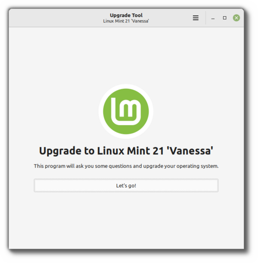

###############################
How to upgrade to Linux Mint 21
###############################

This page explains how to upgrade from Linux Mint 20.3 to Linux Mint 21.

First, refresh your cache and install the Upgrade Tool by typing the following commands in a terminal:

.. code-block:: bash

	apt update
	apt install mintupgrade

Then type the following command to launch the Upgrade Tool:

.. code-block:: bash

	sudo mintupgrade

Follow the instructions on the screen.

When the tool is done and the upgrade is successful uninstall it and reboot your computer.

.. code-block:: bash

	apt remove mintupgrade
	sudo reboot

This is a major upgrade. It can take several hours.

You will be asked to be up to date and to prepare system snapshots. Do not rush, do not take shortcuts.

Don’t hesitate to seek help if you have questions or if you face problems with the upgrade.

Troubleshooting
===============

Installing mintupgrade
----------------------

If you can't find `mintupgrade` in the repositories, switch to the default Linux Mint mirror and refresh the APT cache.

Repairing boot
--------------

If the computer no longer boots, boot from the live Linux Mint 21 ISO.

From the live session, launch `Boot Repair` and use it to fix the boot sequence.

If this doesn't work, boot from the live Linux Mint ISO again, and launch `Timeshift`.

Timeshift is able to scan your drives from the live session and restore your snapshot from there.

Notes
=====

The upgrade overwrites files in `/etc/` with default configuration files. You can restore files indivually by the Timeshift snapshot you made prior to upgrading.

To restore your lightDM settings, run the Login Window configuration tool (:command:`sudo lightdm-settings`).

Alternatives
============

If you cannot upgrade perform a `fresh installation <https://linuxmint-installation-guide.readthedocs.io/en/latest/>`_.

Generic instructions on `fresh upgrades <https://community.linuxmint.com/tutorial/view/2>`_ are also available.
