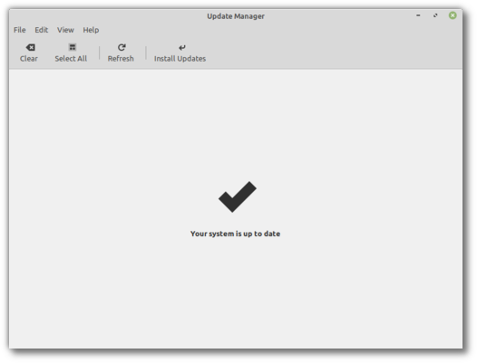
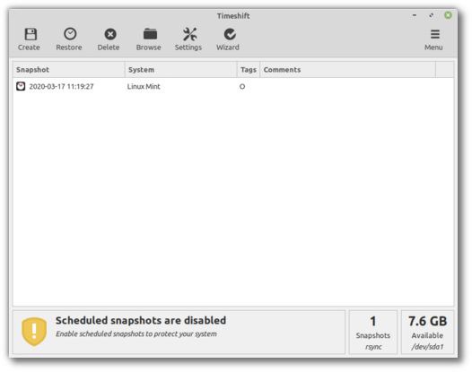

###############################
How to upgrade to Linux Mint 20
###############################

This page explains how to upgrade from Linux Mint 19.3 to Linux Mint 20.

Requirements
============

64-bit architecture
-------------------

Although both 32-bit and 64-bit versions of Linux Mint 19.3 are supported until April 2023, new releases of Linux Mint, including 20,  are only available in 64-bit.

To upgrade to Linux Mint 20 you need to run the 64-bit version of Linux Mint 19.3.

To check which version you're running type:

.. code-block:: bash

	dpkg --print-architecture

If it says **amd64** you can upgrade to Linux Mint 20.

If it says **i386**, it means you're using the 32-bit version. In this case you cannot upgrade and you need to stick with Linux Mint 19.3.

Experience with APT
-------------------

To upgrade to Linux Mint 20 you need experience with APT and the command line.

Upgrading to a newer package base is not trivial and it should not be performed by novice users.

You need to know how to type commands and read their output.

You also need to be experienced with APT. During the upgrade you'll need to understand the output of APT commands. You'll need to understand if a package needs to be removed, if it blocks the upgrade or if it conflicts with another package.

Preparation
===========

Apply all package updates
-------------------------

To apply all updates:

    - Launch the Update Manager with :menuselection:`Menu --> Administration --> Update Manager`.
    - Press the :guilabel:`Refresh` button to update the cache.
    - Press the :guilabel:`Select All` button to select all updates.
    - Press the :guilabel:`Install Updates` button.
    - Follow the instructions from the Update Manager and install all updates until the manager tells you the system is up to date.
    - Reboot the computer.

Create a system snapshot
------------------------

If anything breaks or if anything goes wrong during the upgrade, you can go back in time and revert all changes by restoring your latest system snapshot. Whatever happens, you're covered. You'll be able to restore your operating to this current state, either from within Linux Mint, or by launching Timeshift from a live Mint session (live DVD or live USB).

To create a system snapshot:

    - Launch Timeshift with :menuselection:`Menu --> Administration --> Timeshift`.
    - Follow the wizard to select a destination for your snapshots.
    - In the toolbar, click on the :guilabel:`Create` button to make a manual snapshot of your operating system.

Purge PPAs and 3rd party repositories
-------------------------------------

PPAs or 3rd party repositories can introduce issues during the upgrade if the versions of the packages they provide is higher than in Linux Mint 20. This can result in unmet dependencies, held packages or resolver issues.

To purge 3rd party packages follow these steps:

    - Launch the Software Sources tool from :menuselection:`Menu --> Administration --> Software Sources`.
    - Open the `Additional repositories` tab and disable all additional repositories.
    - Open the `PPA` tab and disable all PPAs.
    - Click on the button to refresh your APT cache.
    - Open the `Maintenance` tab and click on :guilabel:`Downgrade Foreign Packages`.
    - Select all foreign packages and click :guilabel:`Downgrade`.
    - Click on :guilabel:`Remove Foreign Packages`.
    - Select all foreign packages and click :guilabel:`Remove`.
    - Reboot the computer.
    - Create another Timeshift snapshot.

.. note::

	This step is optional but it is strongly recommended. Some PPAs are perfectly fine, some aren't. Some only add packages and don't impact the upgrade process, others introduce dependencies which cannot be resolved.

	You can leave some foreign packages installed or in their 3rd party version and try to upgrade if you want. If it works, then great. If it doesn't, you can always restore the previous snapshot and follow the steps above to purge them before trying again.

Upgrade
=======

Install the upgrade tool
------------------------

To install the upgrade tool, open a terminal and type:

.. code-block:: bash

	apt install mintupgrade

Check the upgrade
-----------------

To simulate an upgrade, open a terminal and type:

.. code-block:: bash

	mintupgrade check

Then follow the instructions on the screen.

This command temporarily points your system to the Linux Mint 20 repositories and calculates the impact of an upgrade.

Note that this command doesn't affect your system. After the simulation is finished, your original repositories are restored.

The output shows you if the upgrade is possible, and if it is, which packages would be upgraded, installed, removed and kept back.

.. note::

	It is extremely important that you pay close attention to the output of this command.

	Keep using :command:`mintupgrade check` and do not proceed to the next step, until you're happy with the output.

.. hint::

	If this steps fails half-way through type :command:`mintupgrade restore-sources` to go back to your original APT configuration.

Download the package updates
----------------------------

To download the packages necessary to upgrade, type the following command:

.. code-block:: bash

	mintupgrade download

Note that this command doesn't actually perform the upgrade itself, but just downloads the packages.

Apply the upgrades
------------------

.. warning:: This step is non-reversible. Once you perform it, the only way to go back is by restoring a system snapshot.

To apply the upgrades, type the following command:

.. code-block:: bash

	mintupgrade upgrade

Downgrade foreign packages
--------------------------

Some of your packages might have a lower version in Linux Mint 20 than in Linux Mint 19.3. To guarantee they function properly, they need to be downgraded.

    - Launch the Software Sources tool from :menuselection:`Menu --> Administration --> Software Sources`.
    - Open the `Maintenance` tab and click on :guilabel:`Downgrade Foreign Packages`.
    - Select all foreign packages and click :guilabel:`Downgrade`.

Delete foreign packages
-----------------------

Some packages no longer exist in Linux Mint 20 and can safely be removed.

    - Launch the Software Sources tool from :menuselection:`Menu --> Administration --> Software Sources`.
    - Open the `Maintenance` tab and click on :guilabel:`Remove Foreign Packages`.
    - With the exception of packages you want to keep, select all foreign packages and click :guilabel:`Remove`.

Troubleshooting
===============

Installing mintupgrade
----------------------

If you can't find `mintupgrade` in the repositories, switch to the default Linux Mint mirror and refresh the APT cache.

Restoring a snapshot
--------------------

A known issue affects Timeshift. When restoring a snapshot, if the `Disclaimer` window is empty, wait for about 2 minutes for the text to appear. Once the disclaimer text is there you can press :guilabel:`Next` and restore your snapshot. Pressing :guilabel:`Next` before the text appears results in a failure to restore. If you did, reboot and try to restore again.

Skipping the timeshift requirement
----------------------------------

If you're using another snapshot tool and would rather not use Timeshift, you can skip the Timeshift requirement with the following command:

.. code-block:: bash

	sudo touch /etc/timeshift.json

Don't forget to remove that file after the upgrade if you want Timeshift to work properly.

Computer freeze
---------------

On some computers the upgrade can be quite intensive and it can temporarily freeze the desktop. This can last for up to 10 minutes at times or even take hours on slow computers. This is OK, be patient and give it time.

If this becomes a problem, logout completely, drop to console with ``CTRL+ALT+F2`` and run :command:`mintupgrade upgrade` from there instead.

Broken boot
-----------

If the computer no longer boots, boot from the live Linux Mint 19.3 ISO.

From the live session, launch `Boot Repair` and use it to fix the boot sequence.

If this doesn't work, boot from the live Linux Mint iso again, and launch `Timeshift`.

Timeshift is able to scan your drives from the live session and restore your snapshot from there.

Notes
=====

The upgrade overwrites files in `/etc/` with default configuration files. You can restore files indivually by the Timeshift snapshot you made prior to upgrading.

To restore your lightDM settings, run the Login Window configuration tool (:command:`sudo lightdm-settings`).

Alternatives
============

If you cannot upgrade perform a `fresh installation <https://linuxmint-installation-guide.readthedocs.io/en/latest/>`_.

Generic instructions on `fresh upgrades <https://community.linuxmint.com/tutorial/view/2>`_ are also available.